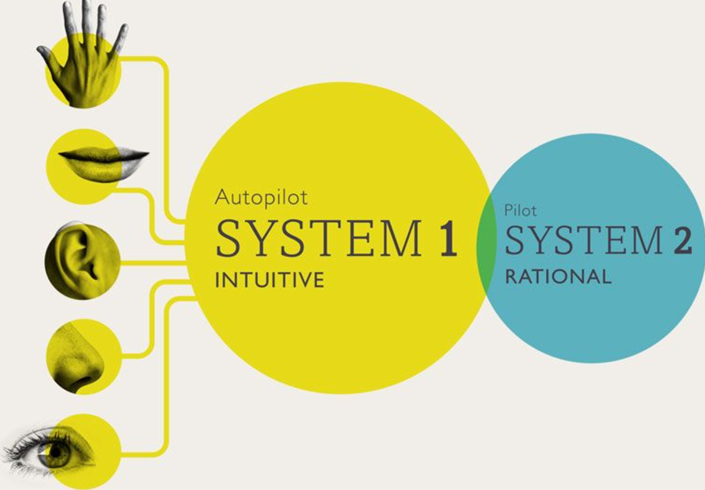

# 01-一张愤怒的脸和一道乘法题
:nofooter:

看到一张愤怒的脸，你几乎不需要动什么脑子，马上就能察觉，这个人生气了，但是问你19*58等于多少，你虽然能即刻反应出，这是一道乘法题，但是你却并不能立刻算出结果，你得一步一步的按乘法规则算出来

## 行为与注意力

这两个问题的区别是，一个很快就能得出结论，几乎不需要思考，我们称之为快思考

另一个需要按部就班的根据逻辑得出结论，思考过程比较费时间，我们称为慢思考

我们称负责快思考模式的部分为系统1，称负责慢思考模式的部分为系统2

系统2显然的一个特点是需要集中注意力，一旦注意力中断，任务就会失败，比如在一篇文章中数出“的”出现的次数

注意力是有限的，所以集中于一项任务时，可能会忽略其他事情，例如看不见的大猩猩

## 系统1遇到麻烦，系统2会出面解决

正常情况下，系统1和系统2同时在运行，系统2只是部分运转，系统1源源不断的为系统2提供印象，直觉，感觉，意向等信息，系统2只是接收这些信息，转化为自主行为

但是，有些情况系统1不能顺利处理，需要系统2提供帮助
	1. 需要费脑力的问题，例如一道乘法题
	2. 令人吃惊的事情，需要系统2进一步进行判断
	3. 与系统1的预设想悖，例如电灯突然自己灭了

系统1和系统2的分工合作是高效的，因为系统1很善于完成自己的本职工作：它在熟悉情境中采取的模式是精确的，所作出的短期预测是准确的，遇到挑战时做出的第一反应也是迅速且基本恰当的

但是，系统1存在成见，会出犯系统性错误，这些成见会影响我们的决策，这些成见就是我们本书要讨论的问题，而且更严重的是，我们通常无法意识到这些成见

## 冲突与自我控制

日常生活中，经常会遇到系统1个系统2冲突的情况，例如，别人冒犯我们很生气，确忍住没有骂回去，这就是系统2在进行自我控制，但是我们系统1确实产生了愤怒的情绪

## 看上去不等长实际上等长的两条线

例如经典的缪勒–莱耶错觉图，两条等长的线看起来就是不一样长，对于这种错觉，我们唯一能做的就是看到这种模式之后，产生警觉，用尺子去量一量，用理性对抗直觉

错觉不只有视觉上的，思维上的也有，通常更难察觉，而且，就算察觉了，也需要调动注意力去费力对抗，所以我们应该采取的策略就是只在关键的决策上才进行对抗吧，其他的随他去吧
