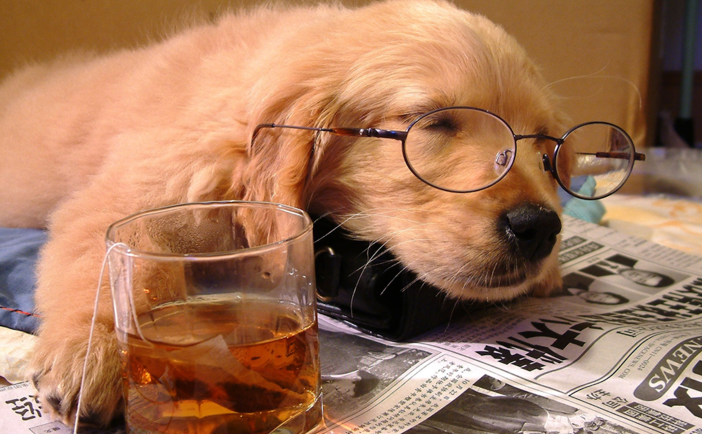

# 03-惰性思维与延迟满足的矛盾



提高运转速度或者切换任务需要付出努力，我们的大脑很懒，并且意志力也有限，大脑通常遵循最省力法则

当然，也不是所有的认知工作都让人厌烦，有过心流体验的人肯定知道那种毫不费力集中精力的感觉

心流区分了两种努力形式
	• 对任务的关注
	• 对注意力的控制
在心流体验中，注意力并不需要控制，可以将所有的资源都倾注到任务上

## 又累又饿的保释官更可能否定保释申请

在对保释官的保释情况进行统计分析后，发现在中饭和晚饭前的一段时间的保释比率，要大大低于刚吃饭完之后的一段时间的保释比率

进行认知活动或者自我控制的时候，需要消耗大量的葡萄糖，所以当体内能量不足的时候人的认知能力就会下降

## 脱口而出的错误答案

```
球拍和球共1.1元
球拍比球贵1元
球多少钱
```

很多人会说1元，因为直觉上看来很快便能想到1元，但是正确答案是1.05元

系统1负责直觉，人们对自己的知觉通常过于自信，这是人脑的通病，系统2很懒啊，所以，对于问题的答案，我们在得出结论之后一定要验证一下，验证一下，验证一下

## 今天得到1000美元，1年以后得到10000美元，你选哪个？

在对一批4岁孩子的研究中，发现能在规定的时间内忍住不吃糖的孩子，也就是自我控制力相对更强一些的孩子，在长大后成功的概率会更好，染上不良习惯的概率更低

也有通过提高控制力来提升孩子智力的研究，研究也取得了很好效果，这可以通过一些提升注意力的游戏来实现

## 小结

系统1是冲动的，凭直觉的，系统2是具备推理能力的，理性的，但系统2也是懒惰的，所以一个人对认知错误的敏感度，一定程度上体现了这个人的思维是否全面，当然，人在疲劳的时候，系统2也是要罢工的
